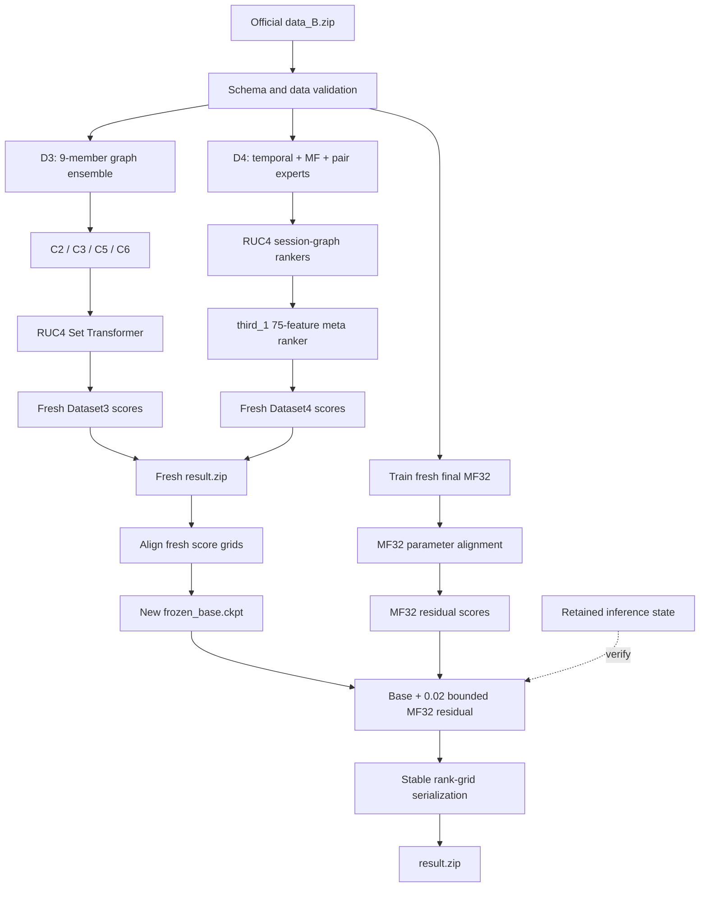
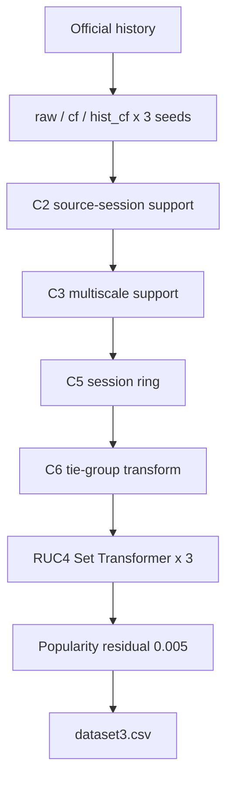
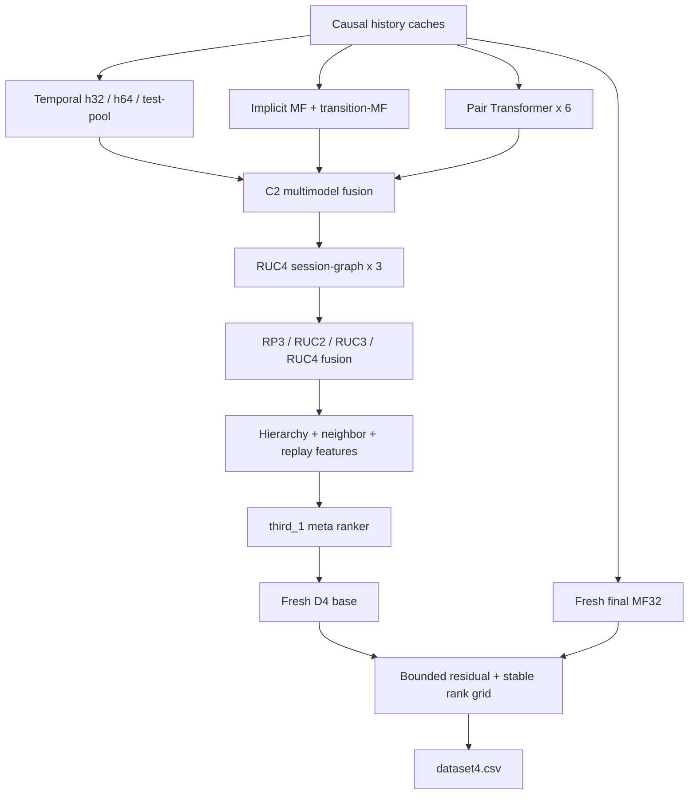

# Track 1 B-list: data_B.zip to 1.5241

<p align="center">
  <strong>Dataset3/Dataset4 training, inference, and deterministic submission construction</strong>
</p>

<p align="center">
  <a href="#quick-start">Quick start</a> ·
  <a href="#system-overview">Architecture</a> ·
  <a href="#dataset3-d3">Dataset3</a> ·
  <a href="#dataset4-d4">Dataset4</a> ·
  <a href="#reproducibility-contract">Reproducibility</a>
</p>

This package executes the complete path from official `data_B.zip` through
Jittor training, fresh inference, fixed numerical alignment, MF32 residual
reranking, and deterministic submission construction. The recorded endpoint is
the B-list score `1.5240999401892983`.

| Route | What runs | Intended use | Final output |
| --- | --- | --- | --- |
| `verify` | Retained inference state and deterministic builder | Fast result verification | Byte-exact `result.zip` |
| `reproduce` | Full D3/D4 training, fresh inference, fixed alignment, final MF32, and residual reranking | `data_B.zip` to recorded 1.5241 chain | Fresh states, newly generated base/MF32, and byte-exact `result.zip` |

The official archive and final submission are not stored in the repository.
Neither route reads test labels or external datasets.

## Quick start

Validated environment: **Ubuntu 22.04**, **NVIDIA RTX 4090**,
**CUDA 12.4**, **Python 3.10**, and **Jittor 1.3.10.0**.

```bash
python3.10 -m venv /data1/sader-repro-py310
source /data1/sader-repro-py310/bin/activate
python -m pip install --upgrade pip
python -m pip install -r requirements.txt
export ML_CACHE_ROOT=/data1/sader-runtime
```

Run either public entry point from `B/`:

```bash
# Fast reconstruction from retained inference state.
python code/main.py verify \
  --data /path/to/data_B.zip \
  --output /data1/b-verify

# data_B.zip -> full training -> fresh inference -> alignment -> 1.5241.
python code/main.py reproduce \
  --data /path/to/data_B.zip \
  --output /data1/b-reproduce
```

The launchers preserve the caller's `CUDA_VISIBLE_DEVICES`. If it is unset,
Jittor uses the first visible GPU. Pass `--gpu N` only to select a physical
device on the current machine explicitly.

Both routes validate the official archive SHA-256:

```text
ded8b0d281042323f0c5871868824038bc7fb675cc3e8211753bb63d8b7b89d2
```

The final `result.zip` SHA-256 is:

```text
9a8867eed4bc8a63c203a82ec4e4d5b37c01ebd57894c39c88296334fc13d9ba
```

The launchers place Jittor, CUDA-wrapper, Python-cache, and temporary files
under the caller-selected runtime directory; they do not modify system CUDA.

## System overview



The full route is coordinated by
[`reproduce_full.py`](code/pipeline/reproduce_full.py). It never reads
`code/assets/locked/`: fresh D3/D4 predictions are required inputs to the fixed
score-space alignment that generates a new `frozen_base.ckpt`. The separately
trained and aligned MF32 then contributes the bounded `0.02` residual used to
rerank that base. All fresh and final artifacts remain in the work directory.
The fixed alignment is treated as a numerical completion layer for operator
drift, machine-level differences, and unavailable intermediate parameters.

| Layer | Dataset3 | Dataset4 |
| --- | --- | --- |
| Base experts | `raw/cf/hist_cf` graph rankers | Temporal attention, implicit MF, transition-MF, pair Transformer |
| Structural refinement | Source/session, multiscale, ring, tie-group | Session graph and hard-negative gate |
| Set-level model | Three-seed Set Transformer | RP3/RUC2/RUC3/RUC4 candidate fusion |
| Meta stage | RUC4 output is preserved | 75-feature hierarchy/neighbor meta ranker |
| Final member | Destination-frequency residual, weight `0.005` | Fresh MF32 residual, weight `0.02` |
| Serialization | Fixed decimal Dataset3 matrix | Stable order mapped to a 100-position rank grid |

## Shared candidate-ranking contract

Every query contains one source and exactly 100 official candidates. Models
rank only those candidates; they do not perform global retrieval. Scores from
different experts are aligned row by row:

```math
\mathrm{qnorm}(x_{i,j}) =
\frac{x_{i,j}-\mu_i}
{\max\left(
\sqrt{\frac{1}{100}\sum_{k=1}^{100}(x_{i,k}-\mu_i)^2},
10^{-6}
\right)}.
```

Training examples use one positive destination and candidate-pool negatives.
For a candidate group with logits `z`, the listwise objective is:

```math
\mathcal{L}_{\mathrm{list}}
=-\log
\frac{\exp(z_y)}
{\sum_{j=1}^{100}\exp(z_j)}.
```

All history caches are cut at the query boundary. Test candidates and times
are used only as unlabeled query structure.

## Dataset3 (D3)

### D3 pipeline



### 1. Nine-member graph ensemble

The base grid is the Cartesian product of three variants and three seeds:

| Variant | Additional signal | Seeds |
| --- | --- | --- |
| `raw` | Common temporal/graph statistics and source-destination embeddings | `20260810`, `20260811`, `20260812` |
| `cf` | Five bipartite neighbor-overlap CF features | Same three seeds |
| `hist_cf` | The CF features plus a masked mean of recent destination embeddings | Same three seeds |

Each member trains a scene model and a compact `FastRanker`.
[`fit_ensemble.py`](code/pipeline/c2_source/code/b_rank_a_port/fit_ensemble.py)
forms 31 components: four standalone heuristics plus base, FastRanker, and
propagated-embedding scores for each of the nine trained members. It fits a
convex mixture on `meta_train`; `validation` can retain that mixture or select
one stronger component, and `confirmation` provides the independent check.

The base scorer combines hand-built graph features, matrix-factorization
compatibility, source/item bias, and, for `hist_cf`, a masked recent-history
mean:

```math
s_3(s,c)=
\mathrm{MLP}(x_{s,c})
+\langle e_s,e_c\rangle+b_s+b_c
+0.7\langle \bar h_s,e_c\rangle,
```

```math
\bar h_s=
\frac{\sum_j m_j e_{h_j}}
{\sum_j m_j+10^{-6}}.
```

Core Jittor path in
[`run.py`](code/pipeline/c2_source/code/b_rank_a_port/run.py):

```python
mlp = self.layers(x).squeeze(-1)
dst_vec = self.dst_emb(dst)
dot = (self.src_emb(src) * dst_vec).sum(dim=1) * self.emb_scale
if self.use_hist and hist_ids is not None and hist_mask is not None:
    hmask = hist_mask.unsqueeze(-1)
    hvec = (self.dst_emb(hist_ids) * hmask).sum(dim=1)
    hvec = hvec / (hmask.sum(dim=1) + 1e-6)
    dot = dot + (hvec * dst_vec).sum(dim=1) * self.hist_scale
bias = self.src_bias(src).squeeze(-1) + self.dst_bias(dst).squeeze(-1)
return mlp + dot + bias
```

### 2. Structural refinement

The ensemble then passes through four explicit candidate-local stages:

| Stage | Signal | Role in the score graph |
| --- | --- | --- |
| C2 | Exact-time cross-source support, then same-source support within `+-300s` excluding exact time | Applies weights `0.10` and `0.05`, respectively |
| C3 | Directional `1s/300s` support on unseen pairs | Uses `[-0.10, 0.225, 0.30, 0.305]` for cross-past, session-future-1s, session-future-300s, and session-past-300s |
| C5 | Session-ring evidence in `(900s, 86400s]` | Selects a unique unseen maximum and uses `[0.2625, 0.28, -0.0525]` for ring past/future/sum |
| C6 | The same ring evidence over tied unseen maxima | Reapplies the C5 residual to unique winners and lifts tied maxima with scale `0.20` |

These stages alter scores only inside the supplied 100-candidate row. Their
validation reports record activation rates, label support, rank deltas, and
negative-row pressure before a policy is admitted.

### 3. RUC4 Set Transformer

The full route trains a three-member rolling-validation grid and a separate
three-member final-fit grid, both with seeds `20260810`, `20260824`, and
`20260907`. The deployed final members use hidden size 64, four attention
heads, two Transformer blocks, FFN width 128, and eight epochs. Each candidate
is first encoded independently, then self-attention lets all 100 candidates
exchange context. The deployed residual scale is fixed at `0.30`.

```python
def execute(self, values):
    values = self.encoder(values)
    for block in self.blocks:
        values = block(values)
    return self.output(values).squeeze(-1)
```

Inside each block, multi-head self-attention and a feed-forward network both
use residual connections and LayerNorm:

```math
H'=\mathrm{LN}(H+\mathrm{MHA}(H,H,H)),
\qquad
H''=\mathrm{LN}(H'+\mathrm{FFN}(H')).
```

`third_1` keeps this D3 member unchanged. The final builder adds a deliberately
small popularity correction derived only from official Dataset3 history:

```math
r_3(s,c)=
\tanh\left(
\frac{1}{2}\mathrm{qnorm}
\bigl(\log(1+\mathrm{count}_{D3}(c))\bigr)
\right),
```

```math
\mathrm{score}_3(s,c)=
\mathrm{base}_3(s,c)+0.005\,r_3(s,c).
```

## Dataset4 (D4)

### D4 pipeline



### 1. Temporal, MF, and pair experts

| Expert family | Members | What it learns |
| --- | ---: | --- |
| Temporal history | `h32 x 3`, `h64 x 3` | Candidate-specific attention over recent causal history |
| Test-pool temporal | `3` | The same temporal mechanism under test-pool replay |
| Implicit MF | `3` | Stable source-item affinity and item bias |
| Transition-MF | `1` | Source transition compatibility |
| Pair-new Transformer | `6` | Candidate-set residuals, hidden sizes `64/96` with three seeds each |

The temporal ranker does not compress history to one query-independent vector.
Each candidate attends to the same past with its own query:

```math
a_{c,j}=
\mathrm{softmax}_j
\left(
\frac{\langle q(c),k(h_j)\rangle}{\sqrt d}
-\tau\Delta t_j
\right),
```

```math
s_{\mathrm{temp}}(s,c)=
\langle u_s,v_c\rangle+b_c
+\left\langle\sum_j a_{c,j}v(h_j),v_c\right\rangle
+s_{\mathrm{exact}}+s_{\mathrm{known}}+s_{\mathrm{static}}.
```

The implementation masks unknown history before softmax and separately models
exact repeats:

```python
attention_score = (query.unsqueeze(2) * key.unsqueeze(1)).sum(dim=3)
attention_score /= float(self.embedding_dim) ** 0.5
attention_score -= history_gap.unsqueeze(1) * self.time_scale
attention_score = jt.where(
    valid.unsqueeze(1), attention_score, jt.full_like(attention_score, -1e9)
)
attention = nn.softmax(attention_score, dim=2)
context = (attention.unsqueeze(3) * value.unsqueeze(1)).sum(dim=2)
sequence = (context * candidate_vec).sum(dim=2)
```

The C2 report fits and validates the expert mixture before
[`d4_multimodel_infer.py`](code/pipeline/code/b_rank/d4_multimodel_infer.py)
streams the Dataset4 score matrix.

### 2. RUC4 session-graph ranker

RUC4 constructs causal replay caches for both `history` and `test_pool`
strategies. Candidate features include session-graph statistics, baseline
`qnorm`, baseline rank, top margin, seen-state, and static features.

The hard-negative gate encodes each candidate and augments it with row mean
and row maximum context:

```python
value = self.candidate(feature)
mean = value.mean(dim=1, keepdims=True)
maximum = value.max(dim=1, keepdims=True)
context = jt.concat(
    [value, value * 0.0 + mean, value * 0.0 + maximum], dim=2
)
return self.output(context).squeeze(-1)
```

Training keeps only rows whose positive pair is unseen. Its mask merges the
top 30 baseline-scored `pair_new` candidates, the top 20 graph-scored
`pair_new` candidates, and the positive; the two top-k sets may overlap.
Three seeds train independently, and the selected residual coefficient is
evaluated on both replay strategies. RP3/RUC2/RUC3/RUC4 then fuse the
candidate evidence into the base consumed by `third_1`.

### 3. The 75-feature meta ranker

`third_1` combines replay, identity, baseline, temporal, MF, transition-MF,
hierarchy, and neighbor evidence. The network separates the first 22
full-history features from the 53 recent/relational features, joins both
encodings locally, and adds the row-mean context before scoring.

For this feature graph, the full route redeploys the `h32/h64` and test-pool
temporal experts, then trains three 512-dimensional full-history MF members
and one 512-dimensional transition-MF member. Their predictions remain
separate feature planes rather than being collapsed into one opaque score.

```python
full = self.full(values[:, :, :22])
recent = self.recent(values[:, :, 22:])
local = self.local(jt.concat((full, recent), dim=2))
context = local.mean(dim=1, keepdims=True)
context_shape = (
    local.shape[0],
    local.shape[1],
    local.shape[2],
)
context = context.broadcast(context_shape)
joined = jt.concat((full, recent, context), dim=2)
return self.output(joined).squeeze(-1)
```

Its hybrid objective combines listwise classification, masked hard-negative
classification, and a differentiable rank surrogate:

```math
\mathcal{L}
=0.50\,\mathcal{L}_{\mathrm{list}}
+0.30\,\mathcal{L}_{\mathrm{hard}}
+0.20\log
\left(
0.5+\sum_j
\sigma\left(\frac{z_j-z_y}{0.25}\right)
+10^{-6}
\right).
```

Inference combines the full view, a reversed candidate view mapped back to
the original order, and a no-recent ablation:
`qnorm(0.40 * full + 0.40 * reverse + 0.20 * no_recent)`. It records the
full/reverse equivariance error and applies the selected margin gate. This
produces the fresh Dataset4 base rather than a detached diagnostic artifact.

### 4. Final MF32 and rank serialization

An independent 32-dimensional implicit-MF member is trained after the fresh
D3/D4 result. It does not replace the aligned frozen base; it performs the
final small-scale reranking on top of that base:

```math
f_{\mathrm{MF32}}(s,c)=\langle u_s,v_c\rangle+b_c.
```

Its row-normalized bounded residual has weight `0.02`:

```math
\mathrm{score}_4(s,c)=
\mathrm{base}_4(s,c)
+0.02\tanh
\left(
\frac{1}{2}\mathrm{qnorm}
\bigl(f_{\mathrm{MF32}}(s,c)\bigr)
\right).
```

A stable descending sort converts the 100 positions to
`linspace(1, 0, 100)`. The values are written back to their original candidate
columns, so candidate identity and column order remain intact.

## Reproducibility contract

The two routes answer different review questions:

| Contract | `verify` | `reproduce` |
| --- | --- | --- |
| Starts from official `data_B.zip` | Yes | Yes |
| Reads `code/assets/locked/` | Yes | No |
| Retrains D3 and D4 | No | Yes |
| Produces fresh D3/D4 matrices | No | Yes |
| Trains final MF32 | No | Yes |
| Final target state | Reads retained base + MF32 | Generates aligned base, then reranks it with MF32 residual |
| Emits runtime receipt | Verification report | Full-chain receipt |
| Requires final ZIP hash | Yes | Yes |

<details>
<summary><strong>Numerical consistency</strong></summary>

Here, full-chain reconstruction means that execution starts from official
`data_B.zip`, runs every training and fresh-inference stage, requires the
recorded fresh source hashes, and then applies the fixed numerical alignment
needed to reach the recorded endpoint. The two numerical steps remain separate:

- Dataset3 is aligned on its `1e10` fixed-point score grid before q35/LZMA
  encoding.
- Dataset4 is aligned on its q7 score grid before little-endian bit packing.
- Missing MF32 parameters are aligned after row-wise q8 quantization.
- The aligned MF32 scores are added to the frozen base with weight `0.02`,
  followed by a stable candidate-local reranking.

Score-grid alignment absorbs machine/operator numerical differences so the
fresh result generates the recorded frozen checkpoint. Parameter alignment
restores the few unavailable historical MF32 values. MF32 then performs its
original role: a small residual reranking over that checkpoint. Both alignment
steps are tied to fresh source hashes; no fast-route weight replaces a fresh
output. The score `1.5240999401892983` and target ZIP hash refer to this complete
official-data-to-submission path.

</details>

<details>
<summary><strong>Data boundary</strong></summary>

Training and learned statistics use only the official archive. Test candidate
and time columns are unlabeled query structure. The code does not read test
ground truth, external datasets, external predictions, or a non-Jittor
deep-learning framework.

`run_reproduce.sh` does not read `code/assets/locked/`. It uses the separately
packaged score/model alignment state only after fresh training and inference.
The `verify` route alone reads retained weights for fast result reconstruction.

</details>

<details>
<summary><strong>Package map</strong></summary>

| Path | Responsibility |
| --- | --- |
| [`code/main.py`](code/main.py) | Public `verify` and `reproduce` commands |
| [`run_verify.sh`](run_verify.sh) | Fast reconstruction and hash verification |
| [`run_reproduce.sh`](run_reproduce.sh) | Full training/inference launcher |
| [`code/pipeline/reproduce_full.py`](code/pipeline/reproduce_full.py) | Full-chain coordinator and receipt |
| [`code/pipeline/c2_source/reproduce_c2.py`](code/pipeline/c2_source/reproduce_c2.py) | Nine-member D3 base and D4 expert bank |
| [`code/pipeline/reproduce_c3.py`](code/pipeline/reproduce_c3.py) | D3 multiscale stage |
| [`code/pipeline/reproduce_c5.py`](code/pipeline/reproduce_c5.py) | D3 session-ring stage |
| [`code/pipeline/reproduce_c6.py`](code/pipeline/reproduce_c6.py) | D3 tie-group stage |
| [`code/pipeline/reproduce_ruc4.py`](code/pipeline/reproduce_ruc4.py) | D3 Set Transformer and D4 session graph |
| [`code/pipeline/reproduce_third_1.py`](code/pipeline/reproduce_third_1.py) | D4 feature graph and meta ranker |
| [`code/pipeline/align_fresh_mf32.py`](code/pipeline/align_fresh_mf32.py) | Fresh MF32 parameter alignment |
| [`code/assets/score_alignment/`](code/assets/score_alignment/) | Fresh score-grid to frozen-base alignment |
| [`code/assets/model_alignment/`](code/assets/model_alignment/) | Fixed MF32 alignment |
| [`code/build_submission.py`](code/build_submission.py) | Final residuals, stable ranking, deterministic ZIP |

</details>

For the pinned environment and recorded fresh source hashes, `reproduce`
executes the complete `data_B.zip -> 1.5240999401892983` reconstruction chain
and emits the byte-exact result plus runtime receipt.
