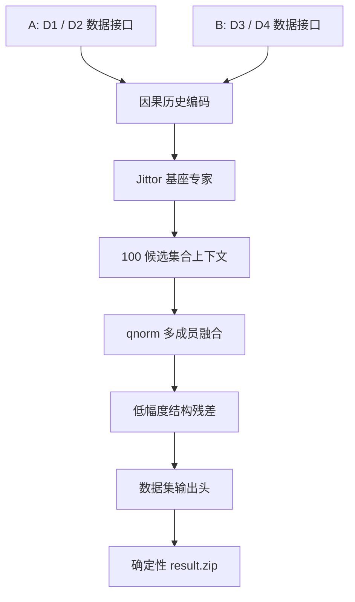
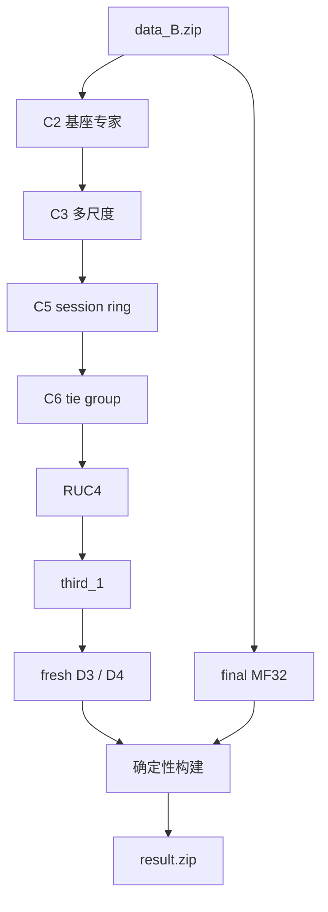

# jittor-sader-jituai

> 一条边发生之后，下一条边会走向哪里？

赛道一时序图推荐方案：**A 榜第 7 名，B 榜第 2 名**。仓库包含
Jittor 训练源码、推理链路、模型状态、审计工具与确定性提交构建器。

[](https://github.com/Jittor/jittor)
[](https://www.python.org/)
[](#architecture)

<p align="center">
  <a href="#quick-start">快速开始</a> ·
  <a href="#architecture">整体架构</a> ·
  <a href="#a-list">A 榜算法</a> ·
  <a href="#b-list">B 榜算法</a> ·
  <a href="#reproducibility">复现边界</a>
</p>

<p align="center">
  <a href="https://commons.wikimedia.org/wiki/File:Collaborative_filtering.gif">
    
  </a>
</p>

一句话概括：给定来源、时间和 100 个候选，让历史交互描述长期偏好，
让时序注意力捕获短期意图，让候选集合内部互相比较，最后输出稳定、
可审计的候选排序。

| 排名 | 数据集 | 主要模型 | 复现入口 |
| --- | --- | --- | --- |
| A 榜第 7 | Dataset1 / Dataset2 | 图特征排序、VAE/BPR、集合模型、结构残差 | [`A/README.md`](A/README.md) |
| B 榜第 2 | Dataset3 / Dataset4 | 九成员图集成、时序/MF/Pair 专家、Set Transformer、元排序 | [`B/README.md`](B/README.md) |

## Quick Start

B 榜提供两条职责明确的公开链路：

```bash
# 快速验证：保留推理状态 -> 确定性提交
python B/code/main.py verify \
  --data /path/to/data_B.zip \
  --output /path/to/verify \
  --gpu 0

# 全链路：官方数据 -> 全部训练 -> fresh 推理 -> 目标状态重建 -> 提交
python B/code/main.py reproduce \
  --data /path/to/data_B.zip \
  --output /path/to/reproduce \
  --gpu 0
```

| 入口 | 是否重训 | 是否生成 fresh 中间结果 | 用途 |
| --- | ---: | ---: | --- |
| `verify` | 否 | 否 | 快速、字节级验证历史提交 |
| `reproduce` | 是 | 是 | 从 `data_B.zip` 检查完整训练与推理链 |

环境、数据哈希与运行命令见
[`B/README.md#quick-start`](B/README.md#quick-start)。A 榜入口与 raw training
说明见 [`A/README.md`](A/README.md)。

## Architecture

任务不是全库召回，而是在每条查询给定的 100 个候选中排序。A/B 榜使用
同一套算法骨架，差异只来自数据方向：实体关系、可用时间字段、历史密度、
样本规模和官方输出格式。所有实例共享三条边界：历史只取查询时刻以前；
测试标签不可见；校准只在当前候选行内进行。



不同成员先在每行内部标准化，避免某个模型仅因分数尺度较大而主导融合：

```math
\mathrm{qnorm}(x_{i,j})=
\frac{x_{i,j}-\mu_i}
{\max\left(
\sqrt{\frac{1}{100}\sum_{k=1}^{100}(x_{i,k}-\mu_i)^2},
10^{-6}
\right)}.
```

统一算法可以写成：

```math
S(s,C_t)=
\mathrm{Fuse}_m
\left[
\mathrm{qnorm}
\bigl(f_m(H_{\le t},s,C_t)\bigr)
\right]
+\lambda\,r(H_{\le t},s,C_t),
```

其中 `H` 是因果历史，`C_t` 是当前 100 候选，`f_m` 是同一候选排序框架下
的数据适配专家，`r` 是候选内结构残差。A/B 榜只替换数据接口与专家配置，
不改变“历史编码—候选打分—集合交互—残差融合—确定性输出”主链。

| 对齐关系 | A 榜实例 | B 榜数据适配 | 保持不变 |
| --- | --- | --- | --- |
| 图方向 | D1 图统计与 embedding 排序 | D3 扩大成员数，并细化时间/session 支持 | 同一 `MLP + embedding + history` 基座与候选内融合 |
| 稀疏方向 | D2 VAE/BPR/Set/Transformer 专家 | D4 按更长历史和更大规模配置 Temporal/MF/Pair/Meta 专家 | 同一多专家、集合上下文与相对排序目标 |
| 后处理 | `qnorm` 后输出概率 | `qnorm` 后输出 rank grid | 候选身份、候选列与行内次序契约 |
| 工程 | 单机批处理 | 流式 cache、分块推理、更多种子 | Jittor、官方数据、无测试标签、哈希审计 |

<a id="a-list"></a>
## A 榜：统一算法的 D1 / D2 实例

### Dataset1 (D1)：图统计与候选条件注意力

[`A/code/raw_training/dataset1/run.py`](A/code/raw_training/dataset1/run.py)
先按时间稳定排序训练边，只使用查询以前的历史构造特征：

| 特征组 | 内容 |
| --- | --- |
| 节点统计 | 来源/目标累计次数、入度、出度、首次与最近交互 |
| 二元关系 | 来源—目标对频次、最近一次交互、候选池出现频率 |
| 局部图 | 最近邻居、入/出邻居重叠、共同邻居 |
| 时间 | 小时、星期、时间间隔与单调新近度 |

基础 `Net` 将统计特征送入 `dim -> 128 -> 64 -> 1` 的 Jittor MLP，
同时学习来源—目标 embedding 内积和两侧偏置：

```math
s_{\mathrm{D1}}(s,c)=
\mathrm{MLP}(x_{s,c})
+\langle e_s,e_c\rangle+b_s+b_c.
```

`NetAttn` 让每个候选分别查询来源的近期目标序列，而不是对历史做一次固定平均：

```math
\alpha_j(c)=\mathrm{softmax}_j
\left(
\frac{\langle W_qe_c,W_ke_{h_j}\rangle}{\sqrt d}
-w_t\Delta t_j
\right),
\qquad
h_s(c)=\sum_j\alpha_j(c)W_ve_{h_j}.
```

训练样本固定为“1 个正目标 + 99 个候选池负例”，直接优化组内交叉熵。
两个固定种子独立训练并集成，减少初始化对候选次序的影响。

### Dataset2 (D2)：稀疏偏好与集合建模

Dataset2 使用按时间端点切分的 CSR 历史。不同成员从互补角度解释同一行候选：

| 成员 | 核心机制 | 训练目标 |
| --- | --- | --- |
| MultVAE | 稀疏历史的变分重构，KL 退火 | 重构候选偏好 |
| RecVAE | 残差编码器与历史先验 | 重构 + 先验约束 |
| BM25-BPR | 时间衰减、BM25 权重、来源/目标 embedding | `softplus(-(positive-negative))` |
| pool / set | 候选池统计与无序集合上下文 | 100 候选组内分类 |
| multi-slice set | 多个历史时间切片 | 跨时间尺度集合比较 |
| Transformer | 候选间自注意力 | 候选条件重排 |
| warm residual | 热节点上的低幅度残差 | 补充而非替代基座 |

最终后处理包含两个稀疏结构信号：

1. 精确 `(src, time)` 组中，其他查询行是否支持该候选；
2. 同时刻跨来源用户对的 BPR embedding 是否进入余弦相似度前 10%。

```math
z=
\mathrm{qnorm}(\log p_{\mathrm{base}})
+0.05\,\mathrm{qnorm}(\mathbb{1}_{\mathrm{exact\ support}})
+0.02\,\mathrm{qnorm}(\mathbb{1}_{\mathrm{community\ top10\%}}),
```

```math
p=\mathrm{softmax}_{100}(z).
```

Dataset1 的来源支持规则只在“最大支持至少 4 且领先第二名至少 2 行”时触发，
并保持其余候选的相对次序。完整尺寸、CRC 与成员哈希约束见
[`A/README.md`](A/README.md)。

<a id="b-list"></a>
## B 榜：统一算法的 D3 / D4 数据适配

B 榜沿用 A 榜的候选排序主链，只把专家规模、时间窗口、结构特征和输出头
适配到 Dataset3/Dataset4，并提供从官方数据开始的可执行训练图：



### Dataset3 (D3)：九成员图集成与结构残差链

#### 1. 基座：`raw / cf / hist_cf x 3 seeds`

三种模型变体分别使用基础图统计、五个二部图邻居重叠 CF 特征，以及
近期目标 embedding 的 masked mean；
每种变体以 `20260810 / 20260811 / 20260812` 三个种子训练，共九个成员。
每个成员都包含 scene model 与 FastRanker，再由
[`fit_ensemble.py`](B/code/pipeline/c2_source/code/b_rank_a_port/fit_ensemble.py)
组成 31 路候选：四个独立启发式，加上每个训练成员的 base、FastRanker
和传播 embedding 分数。在 `meta_train` 拟合凸组合后，`validation`
可以保留该组合或选择更强的单分量，最后由 `confirmation` 独立确认。

主干分数同时表达图统计、稳定兼容性和短期兴趣：

```math
s_3(s,c)=
\mathrm{MLP}(x_{s,c})
+\langle e_s,e_c\rangle+b_s+b_c
+0.7\langle \bar h_s,e_c\rangle,
```

```math
\bar h_s=
\frac{\sum_j m_j e_{h_j}}
{\sum_j m_j+10^{-6}}.
```

`hist_cf` 历史分支的核心实现：

```python
mlp = self.layers(x).squeeze(-1)
dst_vec = self.dst_emb(dst)
dot = (self.src_emb(src) * dst_vec).sum(dim=1) * self.emb_scale
if self.use_hist and hist_ids is not None and hist_mask is not None:
    hmask = hist_mask.unsqueeze(-1)
    hvec = (self.dst_emb(hist_ids) * hmask).sum(dim=1)
    hvec = hvec / (hmask.sum(dim=1) + 1e-6)
    dot = dot + (hvec * dst_vec).sum(dim=1) * self.hist_scale
bias = self.src_bias(src).squeeze(-1) + self.dst_bias(dst).squeeze(-1)
return mlp + dot + bias
```

#### 2. C2 到 RUC4：逐层加入可解释结构

| 阶段 | 输入信号 | 对候选排序做什么 |
| --- | --- | --- |
| C2 | 同时刻跨来源支持；排除同时刻后的同来源 `+-300s` 支持 | 两段权重分别为 `0.10`、`0.05` |
| C3 | 未见 pair 上的 `1s/300s` 方向支持 | cross-past、future-1s、future-300s、past-300s 权重为 `[-0.10, 0.225, 0.30, 0.305]` |
| C5 | `(900s, 86400s]` session ring | 选取唯一未见最大值，past/future/sum 权重为 `[0.2625, 0.28, -0.0525]` |
| C6 | 同一 ring 上并列的未见最大值 | 重施 C5 唯一胜者残差，并以 `0.20` 抬升 tie group |
| RUC4 | 每个候选的基座与结构特征 | 三种子 Set Transformer，残差尺度 `0.30` |

全链路先训练三成员 rolling-audit 网格，再以同样三个种子独立训练最终网格。
部署成员使用 hidden 64、四头注意力、两层 Transformer、128 维 FFN 和
八个 epoch；候选先独立编码，再让 100 个候选交换上下文：

```python
def execute(self, values):
    values = self.encoder(values)
    for block in self.blocks:
        values = block(values)
    return self.output(values).squeeze(-1)
```

```math
H'=\mathrm{LN}(H+\mathrm{MHA}(H,H,H)),
\qquad
H''=\mathrm{LN}(H'+\mathrm{FFN}(H')).
```

最终仅加入来自官方 D3 历史的低幅度目标频次项：

```math
\mathrm{score}_3=
\mathrm{base}_3+
0.005\tanh
\left(
\frac{1}{2}\mathrm{qnorm}(\log(1+\mathrm{count}(c)))
\right).
```

### Dataset4 (D4)：多专家、会话图与层级元排序

#### 1. C2 多专家层

| 专家族 | 数量 | 信息来源 |
| --- | ---: | --- |
| history temporal | `h32 x 3`、`h64 x 3` | 最近 32/64 条因果历史 |
| test-pool temporal | `3` | test-pool 回放下的时序历史 |
| implicit MF | `3` | 来源—目标长期兼容性 |
| transition-MF | `1` | 来源转移模式 |
| pair-new Transformer | `6` | hidden `64/96`，各三个种子，候选集合残差 |

时序专家让候选 `c` 查询历史节点 `h_j`，并直接惩罚较远的真实时间间隔：

```math
a_{c,j}=
\mathrm{softmax}_j
\left(
\frac{\langle q(c),k(h_j)\rangle}{\sqrt d}
-\tau\Delta t_j
\right).
```

```math
s_{\mathrm{temp}}=
\langle u_s,v_c\rangle+b_c
+\left\langle\sum_j a_{c,j}v(h_j),v_c\right\rangle
+s_{\mathrm{exact}}+s_{\mathrm{known}}+s_{\mathrm{static}}.
```

未知历史位置在 softmax 前被 mask；显式重复次数与新近度单独进入
`history_match`，避免 embedding 注意力独自承担重复边识别。

#### 2. RUC4 会话图

RUC4 分别构造 `history` 与 `test_pool` 因果 replay cache。候选特征由
session-graph 统计、基座 `qnorm`、基座名次、top margin、seen 状态和
静态特征组成。

HardNegativeGate 为每个候选拼接三种上下文：

```math
g_i=
\mathrm{MLP}
\left(
h_i,\quad
\frac{1}{100}\sum_jh_j,\quad
\max_j h_j
\right).
```

训练只保留正样本尚未出现的行；候选掩码合并 30 个最高基座
`pair_new` 候选、20 个最高图分数 `pair_new` 候选并显式加入正样本，
两组允许重叠。三个独立种子经过双 replay 策略验证后，与
RP3/RUC2/RUC3 信号一起形成 `third_1` 的基座。

#### 3. `third_1`：75 特征元排序器

元特征覆盖 replay、identity、baseline、temporal、MF、transition-MF、
hierarchy 和 neighbor。网络将前 22 个 full-history 特征与其余 53 个
recent/relational 特征分支编码，再加入整行候选均值上下文：

为构造这组特征，全链路会重新部署 `h32/h64` 与 test-pool 时序专家，
并训练三个 512 维 full-history MF 和一个 512 维 transition-MF；
各成员保留独立特征平面，不会提前压成单一分数。

```python
full = self.full(values[:, :, :22])
recent = self.recent(values[:, :, 22:])
local = self.local(jt.concat((full, recent), dim=2))
context = local.mean(dim=1, keepdims=True)
context = context.broadcast((local.shape[0], local.shape[1], local.shape[2]))
score = self.output(jt.concat((full, recent, context), dim=2)).squeeze(-1)
```

训练目标同时约束全候选分类、困难候选分类和正样本软名次：

```math
\mathcal{L}=
0.50\,\mathcal{L}_{\mathrm{list}}
+0.30\,\mathcal{L}_{\mathrm{hard}}
+0.20\log
\left(
0.5+\sum_j
\sigma\left(\frac{z_j-z_y}{0.25}\right)+10^{-6}
\right).
```

推理融合 full、候选逆序后映射回原位的 reverse，以及 no-recent
三个视图；同时记录 full/reverse 的最大等变误差：

```text
meta_residual = qnorm(0.40 * full + 0.40 * reverse + 0.20 * no_recent)
```

#### 4. final MF32 与 rank grid

完整 D3/D4 fresh 结果生成后，链路独立训练 32 维隐式 MF：

```math
f_{\mathrm{MF32}}(s,c)=\langle u_s,v_c\rangle+b_c,
```

```math
\mathrm{score}_4=
\mathrm{base}_4+
0.02\tanh
\left(
\frac{1}{2}\mathrm{qnorm}(f_{\mathrm{MF32}})
\right).
```

最终按稳定降序映射到 `linspace(1, 0, 100)`，再写回原始候选列。
候选集合、候选身份和列位置在全程保持不变。

更完整的阶段入口、代码链接、训练策略和可复现契约见
[`B/README.md`](B/README.md)。

<a id="reproducibility"></a>
## Reproducibility

| 边界 | A 榜 | B 榜 |
| --- | --- | --- |
| 官方数据 | `data_A.zip` | `data_B.zip` |
| 快速链路 | 保留基座 + 确定性后处理 | 保留推理状态 + 确定性构建 |
| 完整训练 | `code/raw_training/` | `C2 -> C3 -> C5 -> C6 -> RUC4 -> third_1 -> MF32` |
| 数据限制 | 不读测试标签，不使用外部数据 | 不读测试标签，不使用外部数据 |
| 输出审计 | 尺寸、有限值、成员哈希、ZIP 哈希 | 路由隔离、fresh 产物、receipt、成员哈希、ZIP 哈希 |

B 榜全链路先生成 fresh D3/D4 和 fresh MF32，再用密集的目标特定残差
处理历史算子、浮点环境及中间参数缺失造成的差异，重建历史目标状态。
该变换作用于 fresh 产物，不能用历史权重替换 fresh 结果；输入哈希不符时
直接失败。`1.5241` 对应变换后的最终状态，并不是对未变换 fresh 中间结果
单独测得的分数。`reproduce` 不读取 `assets/locked/`，但会读取独立保存的
分数/参数残差；完整边界见
[`B/README.md#reproducibility-contract`](B/README.md#reproducibility-contract)。

最终 B 榜 `result.zip` SHA-256：

```text
9a8867eed4bc8a63c203a82ec4e4d5b37c01ebd57894c39c88296334fc13d9ba
```

## Repository

```text
.
├── A/                  # A 榜复现、raw training 与技术说明
├── B/                  # B 榜双链路、完整训练图与技术说明
├── LICENSE
├── NOTICE.md
└── README.md
```

算法说明依据 [`A/提交说明文档.pdf`](A/提交说明文档.pdf)、
[`B/提交说明文档.pdf`](B/提交说明文档.pdf) 和仓库实际实现整理；
源码与运行时审计结果优先于文字描述。

<details>
<summary>动图来源</summary>

首图为 Wikimedia Commons 上 Moshanin 的
[Collaborative filtering](https://commons.wikimedia.org/wiki/File:Collaborative_filtering.gif)，
采用 CC BY-SA 3.0。它用于解释交互关系，不是模型运行资产。

</details>

## License

Repository code is released under the MIT License. Competition datasets and
third-party dependencies follow their original licenses and distribution rules.
