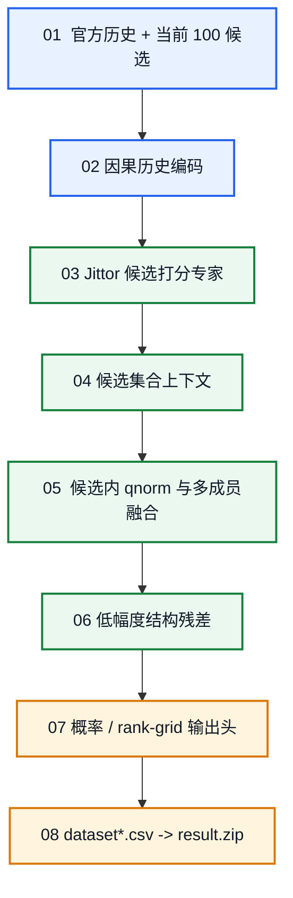

<h1 align="center">基于 Jittor 的时序图候选排序</h1>

<p align="center">
  <strong>赛道一 · A 榜第 7 名 · B 榜第 2 名</strong>
</p>

> 一条边发生之后，下一条边会走向哪里？

`jittor-sader-jituai` 保留了算法实现、训练与推理链路、结果重建和审计工具。

[](https://github.com/Jittor/jittor)
[](https://www.python.org/)
[](#competition)

<p align="center">
  <a href="#competition">赛题说明</a> ·
  <a href="#jittor">Jittor 落点</a> ·
  <a href="#a-list">A 榜具体方案</a> ·
  <a href="#b-list">B 榜具体方案</a> ·
  <a href="#reproduce">复现入口</a>
</p>

<p align="center">
  <a href="https://commons.wikimedia.org/wiki/File:Collaborative_filtering.gif">
    
  </a>
</p>

<a id="competition"></a>
## 1. 赛题说明

赛道一研究**时序交互图上的下一目标预测**。训练数据由按时间发生的
`(src, dst, time)` 交互边组成；测试时，每条查询给出来源节点、必要的时间字段
以及固定的 100 个候选目标。模型不需要从全体节点召回，只需要回答：
**真实目标在这 100 个候选中应排第几。**

### 一个具体例子

假设测试集中有一条查询：

| 查询元素 | 示例 |
| --- | --- |
| 来源节点 | 用户/节点 `42` |
| 查询时刻 | `10:30` |
| 官方候选 | `[13, 7, 88, 21, 5, ...]`，共 100 个 |
| 可见历史 | `42 -> 13` 发生在 5 分钟前；`42 -> 7` 发生在 3 天前 |

模型只能读取 `10:30` 以前的边。时序特征会认为候选 `13` 更近期，embedding
会判断 `42` 与各候选的长期兼容性，集合模型再比较这 100 个候选的相对关系。
例如模型输出：

```text
候选列: [13,   7,   88,  21,  5,   ...]
模型分: [0.82, 0.47, 0.09, 0.31, 0.18, ...]
排序结果: 13 > 7 > 21 > 5 > 88 > ...
```

提交时仍按官方候选列顺序写回 100 个数，不能把候选重新排成另一组，也不能
加入候选集合以外的节点。

设第 `i` 条查询为来源 `s_i`、查询时刻 `t_i` 和候选集合
`C_i={c_i1,...,c_i100}`，模型为每个候选产生分数：

```math
z_{i,j}=f(H_{\le t_i},s_i,c_{i,j},C_i),
\qquad j=1,\ldots,100.
```

其中 `H_{\le t_i}` 只包含查询时刻以前的历史。训练与验证代码使用候选内排序
和 MRR 检查模型是否把真实目标推向前列；提交文件保持 100 列与官方候选逐列
对应。

| 榜单 | 官方数据 | 数据集 | 提交矩阵 | 输出形式 |
| --- | --- | --- | ---: | --- |
| A 榜 | `data_A.zip` | Dataset1 | `61,051 x 100` | 候选概率 |
| A 榜 | `data_A.zip` | Dataset2 | `153,420 x 100` | 候选概率 |
| B 榜 | `data_B.zip` | Dataset3 | `157,670 x 100` | 候选分数 |
| B 榜 | `data_B.zip` | Dataset4 | `2,322,538 x 100` | 固定 rank grid |

记录成绩分别为 A 榜 `1.521072794155721`、B 榜
`1.5240999401892983`。

四个数据集共享同一条算法主链，A/B 榜只做数据方向适配：



**不变的部分**

- 只使用官方历史、来源、时间和候选结构，不读取测试标签，不引入外部数据。
- 所有学习成员都在 Jittor 中训练和前向，比较范围始终是当前 100 个候选。
- 不同成员先做候选内尺度对齐，再进行融合和低幅度结构校正。
- 输出固定候选列、固定序列化规则和 SHA-256 审计。

**只因数据而变化的部分**

- Dataset1/3 更偏向共享节点空间中的图邻域、来源历史和 session 支持。
- Dataset2/4 更偏向稀疏交互、时间切片、隐式反馈和候选集合关系。
- B 榜数据规模更大，因此增加种子数、历史窗口、流式 cache 和分块推理。
- A 榜输出候选概率；B 榜 Dataset4 按官方接口写入固定 rank grid。

<table>
  <tr>
    <td align="center" width="50%">
      <a href="https://commons.wikimedia.org/wiki/File:Barabasi_Albert_model.gif">
        
      </a>
      <br>
      <sub><b>网络生长</b>：新交互不断改变节点的局部结构与热度。</sub>
    </td>
    <td align="center" width="50%">
      <a href="https://commons.wikimedia.org/wiki/File:Social_graph.gif">
        
      </a>
      <br>
      <sub><b>关系展开</b>：来源、目标和历史共同形成候选排序上下文。</sub>
    </td>
  </tr>
</table>

<a id="jittor"></a>
## 2. Jittor 用在哪里

Jittor 不是包装层，而是项目中所有神经网络训练和前向计算的核心框架。
NumPy、Pandas 和 Numba 负责 CSV 解析、图统计、索引与确定性序列化；
可学习参数、自动求导、优化器、损失函数和 GPU 前向都由 Jittor 执行。

| Jittor 能力 | A 榜位置 | B 榜位置 |
| --- | --- | --- |
| `nn.Embedding`、MLP、节点偏置 | D1 图排序器 | D3 九成员图排序器、D4 MF |
| MultVAE / RecVAE | D2 稀疏偏好重构 | 由 D4 更大规模的时序/MF 专家作数据适配 |
| BPR 与 `softplus` 排序损失 | D2 BM25-BPR、community BPR32 | D4 implicit-MF、transition-MF |
| `MultiheadAttention` | D2 multislice Transformer | D3 Set Transformer、D4 Pair Transformer |
| `cross_entropy_loss` | D1/D2 候选组训练 | D3/D4 listwise、hard-negative 训练 |
| `AdamW` 与 CUDA | 各 raw training 成员 | C2、RUC4、`third_1`、final MF32 |

典型 Jittor 候选打分器同时学习来源—目标 embedding、目标偏置和候选分数：

```python
class ImplicitMF(nn.Module):
    def __init__(self, source_count, item_count, embedding_dim):
        self.source = nn.Embedding(source_count, embedding_dim)
        self.item = nn.Embedding(item_count, embedding_dim)
        self.item_bias = nn.Embedding(item_count, 1)

    def execute(self, source, candidates):
        source_vector = self.source(source).unsqueeze(1)
        item_vector = self.item(candidates)
        return (source_vector * item_vector).sum(dim=2) + self.item_bias(candidates).squeeze(2)
```

集合模型同样直接使用 Jittor 的多头注意力、残差连接和 LayerNorm：

```math
H'=\mathrm{LN}(H+\mathrm{MHA}(H,H,H)),
\qquad
H''=\mathrm{LN}(H'+\mathrm{FFN}(H')).
```

主要源码入口：

- A 榜 D1：[`A/code/raw_training/dataset1/run.py`](A/code/raw_training/dataset1/run.py)
- A 榜 D2 VAE/BPR：[`train_vae_jittor.py`](A/code/raw_training/dataset2/train_vae_jittor.py) /
  [`train_bpr_jittor.py`](A/code/raw_training/dataset2/train_bpr_jittor.py)
- B 榜时序注意力：[`temporal_attention_jittor.py`](B/code/pipeline/code/b_rank/temporal_attention_jittor.py)
- B 榜 Set Transformer：[`d3_set_transformer_v49.py`](B/code/pipeline/code/ruc3/d3_set_transformer_v49.py)
- B 榜元排序器：[`train_hierarchy_jittor.py`](B/code/pipeline/code/third_1/train_hierarchy_jittor.py)
- B 榜 final MF32：[`B/code/model.py`](B/code/model.py)

<a id="a-list"></a>
## 3. A 榜具体方案

A 榜包含 Dataset1 和 Dataset2。记录结果为 **第 7 名，
`1.521072794155721`**。详细运行协议见 [`A/README.md`](A/README.md)。

### 3.1 Dataset1：时序图特征与双成员排序

Dataset1 先对训练边做稳定时间排序，只使用查询以前的历史构造四组特征：

| 特征组 | 内容 |
| --- | --- |
| 节点统计 | 来源/目标累计次数、入度、出度、首次与最近交互 |
| 二元关系 | 来源—目标频次、最近一次交互、候选池出现频率 |
| 局部图 | 最近邻居、入/出邻居重叠、共同邻居 |
| 时间 | 小时、星期、时间间隔与单调新近度 |

基础 `Net` 使用 `dim -> 128 -> 64 -> 1` 的 Jittor MLP，同时学习来源/目标
embedding 和偏置：

```math
s_{\mathrm{D1}}(s,c)=
\mathrm{MLP}(x_{s,c})
+\langle e_s,e_c\rangle+b_s+b_c.
```

生产双成员实际调用 `Net(use_hist=False, use_cf=True)`：近期性进入手工时序
特征，额外五个二部图邻居重叠特征补充协同关系；文件中定义的 `NetAttn`
不属于该生产调用链。训练样本固定为“1 个正目标 + 99 个候选池负例”，在每个
候选组内计算交叉熵。两个固定种子 `20260705`、`20260715` 独立训练后集成。

记录结果的 Dataset1 后处理使用同一来源的跨查询支持。只有最大支持至少为 4、
且领先第二名至少 2 行时才触发；其余候选的相对顺序不变。

### 3.2 Dataset2：稀疏偏好与候选集合建模

Dataset2 将时间衰减后的历史表示为 CSR 稀疏矩阵，再从互补方向训练成员：

| 成员 | 作用 | 核心目标 |
| --- | --- | --- |
| MultVAE / RecVAE | 重构来源的全局稀疏偏好 | 重构损失 + KL 约束 |
| BM25-BPR | 学习正目标高于负目标 | `softplus(-(positive-negative))` |
| pool / set | 建模候选池统计和置换不变集合上下文 | 100 候选组内分类 |
| multislice Transformer | 融合多个历史时间切片 | 候选集合注意力 |
| warm residual | 补充热节点行的局部误差 | 低幅度候选残差 |

锁定结果在基座上加入两种可审计结构信号：

1. 同一 `(src, time)` 精确组中的跨行候选支持；
2. 同时刻、同候选的跨来源 BPR32 社区相似度。

```math
z=
\mathrm{qnorm}(\log p_{\mathrm{base}})
+0.05\,\mathrm{qnorm}(I_{\mathrm{exact}})
+0.02\,\mathrm{qnorm}(I_{\mathrm{community}}),
\qquad
p=\mathrm{softmax}_{100}(z).
```

### 3.3 A 榜输出

Dataset1/2 最终写入候选概率；每行保持 100 列、数值有限、候选位置不变。
构建器检查官方数据、基座、BPR32、规则文件、CSV 成员、ZIP CRC 和最终哈希。

<a id="b-list"></a>
## 4. B 榜具体方案

B 榜包含 Dataset3 和 Dataset4。记录结果为 **第 2 名，
`1.5240999401892983`**。它沿用 A 榜“历史编码—候选打分—集合交互—
候选内融合—低幅度残差”的算法主链，只针对数据规模和字段结构扩展成员数量、
时间窗口、cache 和输出头。详细技术说明见 [`B/README.md`](B/README.md)。

### 4.1 Dataset3：九成员图集成与结构链

Dataset3 是 A 榜 Dataset1 图排序方向的数据适配。基座训练
`raw / cf / hist_cf x 3 seeds` 共九个 Jittor 成员：

| 变体 | 数据信号 |
| --- | --- |
| `raw` | 通用时序图统计、来源—目标 embedding |
| `cf` | 增加 5 个二部图邻居重叠特征 |
| `hist_cf` | 在 CF 特征上增加近期目标 embedding 的 masked mean |

九个训练目录进一步产生 base、FastRanker 和传播 embedding 分数，并与四个
独立启发式组成 31 路候选。`meta_train` 拟合凸组合，`validation` 选择组合
或单分量，`confirmation` 独立确认。

| 阶段 | 数据适配内容 | 固定策略 |
| --- | --- | --- |
| C2 | 同时刻跨来源、同来源 `+-300s` 支持 | 权重 `0.10`、`0.05` |
| C3 | 未见 pair 的多尺度方向支持 | `[-0.10, 0.225, 0.30, 0.305]` |
| C5 | `(900s, 86400s]` session ring | `[0.2625, 0.28, -0.0525]` |
| C6 | 并列未见最大值 | tie scale `0.20` |
| RUC4 | 100 候选集合上下文 | 3 seeds、2 blocks、4 heads、scale `0.30` |

最后只加入来自官方 Dataset3 历史的低幅度目标频次项：

```math
\mathrm{score}_3=
\mathrm{base}_3+
0.005\tanh
\left(
\frac{1}{2}\mathrm{qnorm}(\log(1+\mathrm{count}(c)))
\right).
```

### 4.2 Dataset4：时序/MF 专家与 75 特征元排序

Dataset4 是 A 榜 Dataset2 稀疏交互方向的数据适配。它保留多专家与候选集合
融合框架，按更长历史和更大数据规模配置成员：

| 专家族 | 数量 | 数据作用 |
| --- | ---: | --- |
| history temporal | `h32 x 3`、`h64 x 3` | 候选条件的近期历史注意力 |
| test-pool temporal | `3` | test-pool 回放下的时序偏好 |
| implicit MF | `3` | 来源—目标长期兼容性 |
| transition-MF | `1` | 来源转移模式 |
| pair-new Transformer | `6` | hidden `64/96` 的候选集合残差 |

候选 `c` 对历史节点 `h_j` 的注意力同时考虑 embedding 相似度和真实时间间隔：

```math
a_{c,j}=
\mathrm{softmax}_j
\left(
\frac{\langle q(c),k(h_j)\rangle}{\sqrt d}
-\tau\Delta t_j
\right).
```

RUC4 再构造 `history` / `test_pool` replay cache，训练三种子 session-graph
hard ranker。`third_1` 将 replay、identity、baseline、temporal、MF、
transition-MF、hierarchy 和 neighbor 合并为 75 个特征。

元排序器分开编码前 22 个 full-history 特征与其余 53 个 recent/relational
特征，再加入整行候选均值：

```python
full = self.full(values[:, :, :22])
recent = self.recent(values[:, :, 22:])
local = self.local(jt.concat((full, recent), dim=2))
context = local.mean(dim=1, keepdims=True)
score = self.output(jt.concat((full, recent, context), dim=2)).squeeze(-1)
```

训练目标联合 listwise、hard-negative 和 soft-rank：

```math
\mathcal{L}=
0.50\,\mathcal{L}_{\mathrm{list}}
+0.30\,\mathcal{L}_{\mathrm{hard}}
+0.20\,\mathcal{L}_{\mathrm{soft\ rank}}.
```

推理融合 full、reverse 和 no-recent 三个视图：

```text
meta_residual = qnorm(0.40 * full + 0.40 * reverse + 0.20 * no_recent)
```

最后独立训练 32 维 implicit MF，并以 `0.02` 有界残差加入 D4 基座：

```math
f_{\mathrm{MF32}}(s,c)=\langle u_s,v_c\rangle+b_c,
```

```math
\mathrm{score}_4=
\mathrm{base}_4+
0.02\tanh
\left(
\frac{1}{2}\mathrm{qnorm}(f_{\mathrm{MF32}})
\right).
```

稳定降序后映射到 `linspace(1, 0, 100)`，再写回原候选列。

### 4.3 A/B 榜如何保持基本一致

| 算法层 | A 榜 | B 榜数据方向适配 |
| --- | --- | --- |
| 历史编码 | 时间图统计、CSR 稀疏历史 | 增大实体索引、历史窗口和流式 cache |
| 基座专家 | 图排序、VAE/BPR、Set/Transformer | 增加种子、Temporal/MF/Pair 容量 |
| 候选上下文 | pool/set/Transformer | Set Transformer、session graph、meta ranker |
| 融合 | 候选内 `qnorm` + 低幅度残差 | 同样的 `qnorm` + 有界残差 |
| 输出头 | 候选概率 | Dataset3 分数 / Dataset4 rank grid |
| 数据边界 | 官方历史、无测试标签 | 完全相同 |

所以 A/B 榜的变化不是重新定义算法，而是对数据字段、规模、历史跨度和官方
输出接口的实例化适配。

<a id="reproduce"></a>
## 5. 复现入口

先理解赛题和算法，再选择对应榜单的执行路径。

### A 榜

```bash
# 快速重建记录结果
python A/code/main.py verify \
  --data /path/to/data_A.zip \
  --output /path/to/a-verify

# 从官方数据训练 raw Jittor 成员并执行 fresh 推理
python A/code/main.py raw \
  --data /path/to/data_A.zip \
  --models /path/to/a-models \
  --output /path/to/a-fresh
```

### B 榜

```bash
# 快速重建记录结果
python B/code/main.py verify \
  --data /path/to/data_B.zip \
  --output /path/to/b-verify \
  --gpu 0

# 官方数据 -> 全部训练 -> fresh 推理 -> 目标状态重建 -> 提交
python B/code/main.py reproduce \
  --data /path/to/data_B.zip \
  --output /path/to/b-reproduce \
  --gpu 0
```

| 路径 | 训练 | 主要用途 |
| --- | --- | --- |
| A `verify` | 不重训 | 快速复验 A 榜记录结果 |
| A `raw` | 重训 A 榜 raw 成员 | 审阅训练与 fresh 推理 |
| B `verify` | 不重训 | 快速复验 B 榜记录结果 |
| B `reproduce` | 重训 D3/D4 与 final MF32 | 打通官方数据到最终提交的完整调用链 |

B 榜全链路先生成 fresh D3/D4 和 fresh MF32，再以目标特定的分数/参数残差
处理历史算子、环境和中间参数缺失造成的确定性差异。变换必须作用于 fresh
产物，不能用历史权重覆盖；输入哈希不符时直接失败。详细边界见
[`B/README.md#reproducibility-contract`](B/README.md#reproducibility-contract)。

最终 B 榜 `result.zip` SHA-256：

```text
9a8867eed4bc8a63c203a82ec4e4d5b37c01ebd57894c39c88296334fc13d9ba
```

## Repository

```text
.
├── A/                  # A 榜复现、raw training 与技术说明
├── B/                  # B 榜双链路、完整训练图与技术说明
├── LICENSE
├── NOTICE.md
└── README.md
```

算法说明以 [`A/提交说明文档.pdf`](A/提交说明文档.pdf)、
[`B/提交说明文档.pdf`](B/提交说明文档.pdf) 和实际源码为准。

<details>
<summary>GIF 来源与授权</summary>

- [Collaborative filtering](https://commons.wikimedia.org/wiki/File:Collaborative_filtering.gif)，Moshanin。
- [Barabási–Albert model](https://commons.wikimedia.org/wiki/File:Barabasi_Albert_model.gif)，Harp。
- [Social graph](https://commons.wikimedia.org/wiki/File:Social_graph.gif)，Festys。

以上资源来自 Wikimedia Commons，采用 CC BY-SA 3.0；仅用于说明图关系，
不是模型训练或推理资产。

</details>

## License

Repository code is released under the MIT License. Competition datasets and
third-party dependencies follow their original licenses and distribution rules.
